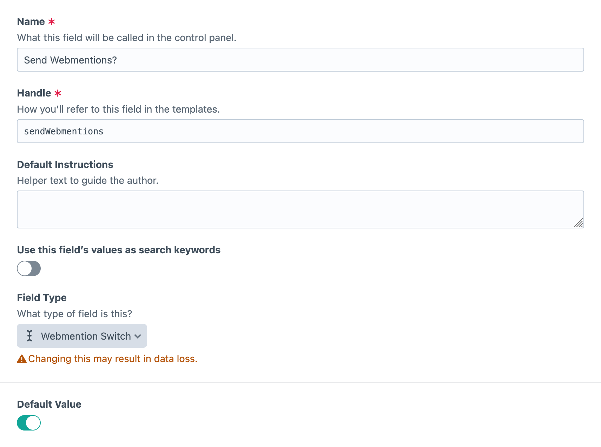
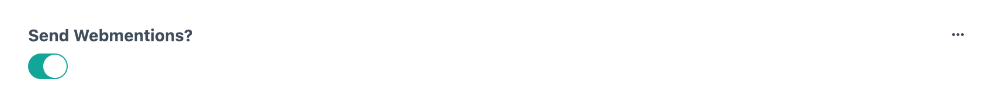
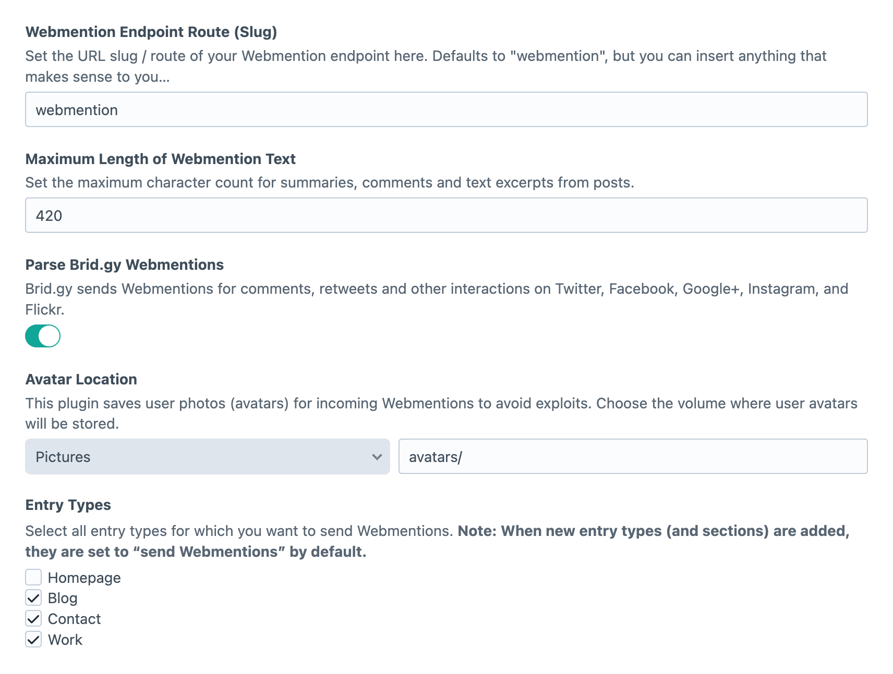

<p align="center"></p>

<h1 align="center">Webmention for Craft CMS</h1>

This plugin provides a [Webmention](https://www.w3.org/TR/webmention/) endpoint for [Craft CMS](https://craftcms.com) and allows for sending Webmentions to other sites.

**Table of Contents:**

- [Requirements](#requirements)
- [Installation](#installation)
- [Receiving Webmentions: The Webmention endpoint](#receiving-webmentions-the-webmention-endpoint)
- [Sending Webmentions](#sending-webmentions)
- [Craft Plugin Settings](#craft-plugin-settings)
- [Features](#features)
- [Roadmap](#roadmap)
- [Updating from v0.3](#updating-from-v03)
- [Thank You!](#thank-you)
- [License](#license)
- [Author](#author)

## Requirements
This plugin requires Craft CMS 5.6.10 or later.

## Installation
You can install this plugin from Craft’s in-app Plugin Store.

Go to the Plugin Store in your project’s Control Panel and search for “Webmention”, then click on the “Install” button in the sidebar.

After installing, run the following CLI command to copy an example webmention submission template into your project’s `templates/` directory:

```sh
php craft webmention/example-template
```

> [!NOTE]  
> If you’re updating from Webmention v0.3, [follow these instructions](#updating-from-v03) as well.

## Receiving Webmentions: The Webmention endpoint
In order to receive Webmentions, the Webmention endpoint of your site needs to be discoverable by the server sending the Webmention. So you will need to add the following line in the `<head>` section of your main layout template:

```twig
<link rel="webmention" href="{{ craft.webmention.endpointUrl }}" />
```

And/or you can set an HTTP Link header by adding this line to your main layout template:

```twig

```

The plugin comes with a „human-friendly“ endpoint that will present a form with input fields for `source` and `target` to users visiting your site's endoint route. The Twig template for the Webmention endpoint will extend your standard template and is copied to `craft/templates/webmention/_index.html` on install. You can then adjust the template to your needs. Note: Even if you define a different route for the endpoint, the plugin will still look for the template in this folder.

### Displaying Webmentions
To output all Webmentions for the current request URL, you can use the following helper in your templates:

```twig
{{ craft.webmention.showWebmentions() }}
```

If you want full control over the HTML output for Webmentions, you can fetch all Webmentions for the current URL:

```twig

  <li>
    <a href="{{ webmention.source }}">{{ webmention.authorName }}</a>:
    {{ webmention.text }}
  </li>

```

To fetch all Webmentions for an element, you can call `getWebmentions()` on the element:

```twig

  …

```

### Display a Webmention form for the current URL
You can output a form in your entry template that provides the user with the opportunity to send you the URL of a response.
Simply use this helper:

```twig
{{ craft.webmention.webmentionForm() }}
```

## Sending Webmentions
Once installed, your Craft site will automatically send Webmentions to other sites. On every save of a published entry, the plugin scans the complete entry for any occurrences of URLs and then sends Webmentions to the corresponding Webmention endpoints.

### Sending Webmentions for certain entry types only
By default, Webmentions are sent for all entry types but you can also restrict this to certain entry types. Please make sure to go to the settings page of the plugin and select for which entry types Webmentions should be sent.

### Switching Webmentions on/off for individual entries
There may be times you want to disable the Webmentions sending functionality on a per-entry basis. This can be accomplished by adding a new “Webmention Switch” field to the field layout of an Entry Type.



You are now able to switch Webmention sending on or off for individual entries! 



**This setting overrides the Entry Type-specific settings from the settings page.** So if you, for example, disable Webmentions for an Entry Type, you can still send them for individual entries by installing the magic switch. ;)

## Craft Plugin Settings

Webmention settings can be accessed from **Settings** → **Webmention**.



You can change the following options:

* **Webmention Endpoint Route (Slug)**    
Set the URL slug of your Webmention endpoint. Defaults to `webmention`, but you can insert anything that makes sense to you.

* **Maximum Length of Webmention Text**    
  Set the maximum character count for summaries, comments and text excerpts from posts. Default: `420`

* **Parse Brid.gy Webmentions**    
Toggle if you want the plugin to parse [Brid.gy](https://brid.gy) Webmentions.

* **Avatar Location**     
The plugin saves user photos (avatars) for incoming Webmentions for better performance and to avoid exploits. You can set the volume and subfolder path where user avatars will be stored.

* **Entry Types**    
Lets you select all entry types for which you want to send Webmentions. When new entry types are added, they are set to “send Webmentions” by default.

## Features

### Receiving Webmentions

When the plugin receives a Webmention, it performs several checks and then parses the source’s HTML with both [php-mf2](https://github.com/indieweb/php-mf2), a generic [microformats-2](http://microformats.org/wiki/microformats-2) parser, and Aaron Parecki’s [php-comments helper](https://github.com/indieweb/php-comments), which returns author info as well as truncated post text for an [h-entry](http://indiewebcamp.com/h-entry). The plugin will try to get all attributes for the data model from the parsed h-entry and also the representative h-card. If no user photo is provided, it will also try to get one from Gravatar as a fallback, using the author’s email from the h-card.

The following attributes are looked up:  

* `authorName`
* `authorPhoto`
* `authorUrl`
* `published`
* `name`
* `text`
* `target`
* `source`
* `hEntryUrl`
* `host`
* `type`

Lastly, the Webmention record is saved to the database. Already existing Webmentions (which is determined by a comparison of the `source` and `target` of the POST request) are updated in the database.

### XSS Protection
To prevent Cross Site Scripting (XSS) attacks, the HTML of the source first gets decoded (which for example converts `&#00060script>` into `<script>`) and is then purified with [CHTMLPurifier](http://www.yiiframework.com/doc/api/CHtmlPurifier), Yii’s wrapper for [HTML Purifier](http://htmlpurifier.org/), which “removes all malicious code with a thoroughly audited, secure yet permissive whitelist”.

### Brid.gy

You can use Brid.gy for receiving Webmentions for posts, comments, retweets, likes, etc. from Twitter, Instagram, Facebook, Flickr, and Google+. This plugin will understand the Webmention and set the 'type' of the Webmention accordingly. So if someone retweets a tweet with a URL you shared, the Webmention will be of the type 'retweet'. To determine the interaction type, the plugin looks at the brid.gy URL format, for more information on the different types of URLs visit [the section about source URLs on the brid.gy website](https://brid.gy/about#source-urls).

If you don't use Brid.gy you can easily deactivate the parsing in the plugin settings.

### HTTP Responses

The Webmention plugin validates and processes the request and then returns HTTP status codes for certain errors or the successful processing of the Webmention:

-  If the URLs provided for `source` and `target` do not match an http(s) scheme, a **400 Bad Request** status code is returned.
-  If the specified target URL is not found, a **400 Bad Request** status code is returned.
-  Also, if the provided `source` is not linking back to `target`, the answer will be a resounding **400 Bad Request**!
-  On success, the plugin responds with a status of **200 OK**.

**Note: Currently, the plugin does not process the Webmention verification asynchronously.**

## Roadmap
- Provide an easy way to change how Webmentions are displayed (e. g. grouping y/n)
- …

## Updating from v0.3
To update from Webmention 0.3 on Craft 2, do the following after upgrading Craft CMS:

1. Follow the [installation instructions](#installation).
2. Go to **Settings** → **Webmention** and select the volume that avatars are stored in, from the **Avatar Location** setting.
3. Run the following CLI command to update your existing webmentions’ avatar relations:
   ```sh
   php craft webmention/update-avatars
   ```
4. Run the following CLI command to update search indexes for existing webmentions:
   ```sh
   php craft resave/webmentions --update-search-index
   ```
5. Update your templates based on the following changes:

   Old | New
   -------- | --------
   `webmention.author_name` | `webmention.authorName`
   `webmention.author_url` | `webmention.authorUrl`
   `webmention.author_photo` | `webmention.avatar.getUrl()`
   `webmention.url` | `webmention.hEntryUrl`
   `webmention.site` | `webmention.host`
   `craft.webmention.getAllWebmentionsForEntry(craft.request.url)` | `craft.webmention.getWebmentions()`
   `craft.webmention.showWebmentions(craft.request.url)` | `craft.webmention.showWebmentions()`
   `craft.webmention.webmentionForm(craft.request.url)` | `craft.webmention.webmentionForm()`


> [!NOTE]  
> If you have any webmentions which contain double-encoded HTML entities, you can update them via the “Update” action in the UI, or with the following command:
>
> ```sh
> php craft webmention/update --webmention-id=123
> ```

## Thank You!
Thanks to everyone who helped me setting this up:
– [Jason Garber](https://sixtwothree.org/) (@jgarber) for his [webmention client plugin](https://github.com/jgarber623/craft-webmention-client) and the kind permission to reuse parts of the code when implementing the sending functionality.
- [Aaron Parecki](https://aaronparecki.com/) (@aaronpk) for support and feedback – and also for the great work he does related to Webmention.
- [Bastian Allgeier](http://bastianallgeier.com) (@bastianallgeier) for allowing me to get highly inspired by his [Kirby Webmentions Plugin](https://github.com/bastianallgeier/kirby-webmentions)
- [Tom Arnold](https://www.webrocker.de/) (@webrocker) for relentlessly sending test Webmentions. ;) Also for feedback on Webmention sending settings.
- [Jeremy Keith](https://adactio.com) (@adactio) for the feedback and also for giving the initial spark.
- Everyone at the IndieWebCamps Düsseldorf and Berlin 2016 and in the IndieWeb Community!
- [Brandon Kelly](brandonkelly.io) for basically rewriting the plugin to add support for Craft 5 and a lot more 🔥🎉

## License

Code released under [the MIT license](https://github.com/matthiasott/webmention/LICENSE).

## Authors

Matthias Ott   
<mail@matthiasott.com>  
<https://matthiasott.com>

Brandon Kelly
<brandon@pixelandtonic.com>
<https://brandonkelly.io>
