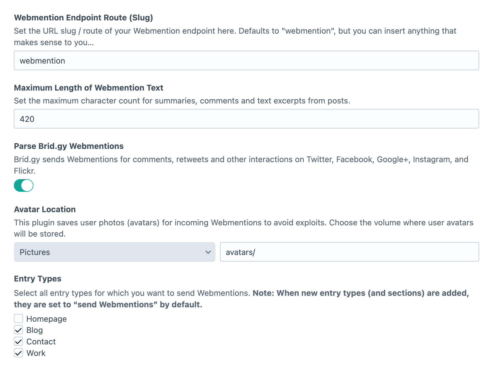
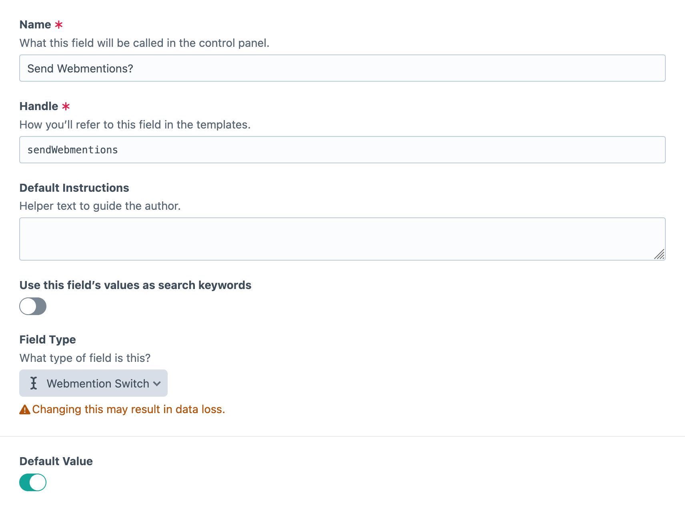
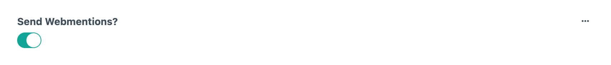

<p align="center"></p>

<h1 align="center">Webmention for Craft CMS</h1>

This plugin provides a [Webmention](https://www.w3.org/TR/webmention/) endpoint for [Craft CMS](https://craftcms.com) and allows for sending Webmentions to other sites.

## Table of Contents

- [Requirements](#requirements)
- [Installation](#installation)
    - [Plugin Store](#plugin-store)
    - [Composer](#composer)
    - [Queue runner](#queue-runner)
- [Configuring the plugin](#configuring-the-plugin)
    - [Webmention Endpoint Route (Slug)](#webmention-endpoint-route-slug)
    - [Maximum Length of Webmention Text](#maximum-length-of-webmention-text)
    - [Parse Brid.gy Webmentions](#parse-bridgy-webmentions)
    - [Failure Retention (Days)](#failure-retention-days)
    - [Threaded Display](#threaded-display)
    - [Rate limit per hour](#rate-limit-per-hour)
    - [Trusted source hosts](#trusted-source-hosts)
    - [Failure backoff threshold](#failure-backoff-threshold)
    - [Avatar Location](#avatar-location)
    - [Entry Types](#entry-types)
    - [Permissions](#permissions)
- [Receiving Webmentions](#receiving-webmentions)
    - [Endpoint discovery](#endpoint-discovery)
    - [The endpoint template](#the-endpoint-template)
    - [Webmention types](#webmention-types)
    - [HTTP responses](#http-responses)
    - [Manual receive via CLI](#manual-receive-via-cli)
- [Displaying Webmentions](#displaying-webmentions)
    - [The default template](#the-default-template)
    - [Fetching Webmentions in templates](#fetching-webmentions-in-templates)
    - [Threading](#threading)
    - [Eager-loading](#eager-loading)
    - [Webmention form](#webmention-form)
    - [Customizing the markup](#customizing-the-markup)
- [Sending Webmentions](#sending-webmentions)
    - [Sending for certain entry types only](#sending-for-certain-entry-types-only)
    - [Switching Webmentions on/off for individual entries](#switching-webmentions-onoff-for-individual-entries)
- [Maintenance](#maintenance)
    - [Failed Webmentions view](#failed-webmentions-view)
    - [Cleaning up old failure records](#cleaning-up-old-failure-records)
    - [Logging](#logging)
- [CLI reference](#cli-reference)
- [Bridgy and social integrations](#bridgy-and-social-integrations)
    - [How interaction types are detected](#how-interaction-types-are-detected)
    - [Bluesky author fallback](#bluesky-author-fallback)
- [Security](#security)
    - [HTML sanitization](#html-sanitization)
    - [URL validation](#url-validation)
    - [Rate limiting and abuse protection](#rate-limiting-and-abuse-protection)
    - [Outbound request protection](#outbound-request-protection)
    - [Reporting issues](#reporting-issues)
- [Privacy](#privacy)
    - [What's stored](#whats-stored)
    - [Retention and deletion](#retention-and-deletion)
- [Twig reference](#twig-reference)
- [Upgrade notes](#upgrade-notes)
    - [Updating to v1.5.0](#updating-to-v150)
    - [Updating from v0.3](#updating-from-v03)
    - [Changelog](#changelog)
- [Roadmap](#roadmap)
- [Thank You!](#thank-you)
- [License](#license)
- [Authors](#authors)

## Requirements

This plugin requires Craft CMS 5.6.10 or later and PHP 8.2 or later.

## Installation

### Plugin Store

You can install this plugin from Craft's in-app Plugin Store.

Go to the Plugin Store in your project's Control Panel and search for "Webmention", then click on the "Install" button in the sidebar.

> [!NOTE]
> If you're updating from Webmention v0.3, [follow these instructions](#updating-from-v03) as well.

### Composer

Or install via Composer:

```sh
composer require matthiasott/webmention
php craft plugin/install webmention
```

### Queue runner

Webmentions are processed **asynchronously** via Craft's queue. Make sure you have a queue runner in place — otherwise queued jobs will only run when someone visits the Control Panel.

The simplest option is a cron entry that calls Craft's queue runner every minute:

```cron
* * * * * /usr/bin/php /path/to/craft queue/run
```

For higher-traffic sites, run `php craft queue/listen` as a long-running daemon (e.g. via systemd or supervisord). See [the Craft docs on queue runners](https://craftcms.com/docs/5.x/system/queue.html) for details.

## Configuring the plugin

Webmention settings can be accessed from **Settings** → **Webmention**.



The following options are available:

### Webmention Endpoint Route (Slug)

Set the URL slug of your Webmention endpoint. Defaults to `webmention`, but you can insert anything that makes sense to you.

### Maximum Length of Webmention Text

Set the maximum character count for summaries, comments and text excerpts from posts. Default: `420`.

### Parse Brid.gy Webmentions

Toggle if you want the plugin to parse [Brid.gy](https://brid.gy) Webmentions. See [Bridgy and social integrations](#bridgy-and-social-integrations).

### Failure Retention (Days)

Number of days that failed Webmention records are kept before they can be purged by the cleanup command. Default: `30`. See [Cleaning up old failure records](#cleaning-up-old-failure-records).

### Threaded Display

When enabled, replies to other Webmentions are displayed as nested threads in the default template. When disabled, all Webmentions are shown in a flat list. Default: enabled. See [Threading](#threading).

### Rate limit per hour

Cap on the number of Webmention submissions accepted per remote IP, per hour. Default: `100`. Set to `0` to disable. Senders that exceed the limit receive a `429 Too Many Requests` response.

Submissions whose source host matches an entry in [Trusted source hosts](#trusted-source-hosts) bypass this limit.

### Trusted source hosts

A list of source hostnames (and their subdomains) that are exempted from both the per-IP rate limit and the private/reserved-IP check that protects against SSRF. Default: `['brid.gy']`, which automatically covers `fed.brid.gy` and `bsky.brid.gy`.

Add additional hosts here if you operate a high-volume Webmention sender of your own (a homelab Mastodon, an intranet Micropub server, another aggregator service) whose traffic should not be throttled and which may live behind a private IP.

This setting applies to **incoming** Webmentions only. Outbound sending never contacts a private or reserved address — see [Outbound request protection](#outbound-request-protection).

### Failure backoff threshold

After a (`source`, `target`) pair has been recorded as a failure this many times, further submissions for that pair are no longer queued or fetched until the failure record is purged via the cleanup command. Default: `5`. Set to `0` to disable.

This prevents an attacker (or a misbehaving sender) from forcing repeated outbound fetches against the same broken pair. The failure row's attempt counter still increments so repeated abuse stays visible in the [Failed Webmentions view](#failed-webmentions-view).

### Avatar Location

The plugin saves user photos (avatars) for incoming Webmentions to a Craft Asset volume. Storing them locally keeps your visitors' IP addresses from leaking to remote image hosts, and improves front-end performance.

You can set the volume and subfolder path where avatars will be stored. The volume needs to expose public URLs (so the saved avatars can be served by `getUrl()` in templates).

### Entry Types

Select all entry types for which you want to send Webmentions. When new entry types are added, they are set to "send Webmentions" by default. See [Sending Webmentions](#sending-webmentions).

### Permissions

The plugin registers two user permissions:

| Permission | Grants |
|---|---|
| **View webmentions and the failure log** | The Webmentions section in the Control Panel, including the [Failed Webmentions view](#failed-webmentions-view). |
| **Manage webmentions** | Retrying, dismissing, and deleting Webmentions and failure records. |

Admins have both, as do all users on Craft Solo. On Team and Pro, grant them under **Settings** → **Users**. Users without the view permission don't see the Webmentions nav item at all.

Front-end output is unaffected — templates render Webmentions for all visitors regardless of permissions.

## Receiving Webmentions

### Endpoint discovery

In order to receive Webmentions, the Webmention endpoint of your site needs to be discoverable by the server sending the Webmention. There are two ways to advertise it — using both is recommended, since some senders look for one or the other:

Add this line to the `<head>` section of your main layout template:

```twig
<link rel="webmention" href="{{ craft.webmention.endpointUrl }}" />
```

And/or set an HTTP `Link` header by adding this line to your main layout template:

```twig

```

### The endpoint template

Visiting your endpoint route in a browser shows a form with `source` and `target` fields, so people can send you a Webmention by hand. The template extends your site's standard layout. Run the following command to copy an example endpoint template into your project's `templates/` directory:

```sh
php craft webmention/example-template
```

You can then adjust the template to your needs.

### Webmention types

When the plugin processes an incoming Webmention, it classifies the interaction into one of the following types based on the source's microformats data and (if Brid.gy parsing is enabled) the source URL pattern:

| Type | Meaning |
|---|---|
| `mention` | A generic mention or link |
| `comment` | A comment or reply |
| `like` | A like / favorite |
| `repost` | A repost / boost / share |
| `rsvp` | An RSVP to an event |

You can filter by type when fetching Webmentions in templates — see [Fetching Webmentions in templates](#fetching-webmentions-in-templates).

### HTTP responses

Because Webmention processing happens asynchronously, the plugin's direct HTTP responses are mostly status codes only:

| Status | Meaning |
|---|---|
| `202 Accepted` | The Webmention has been queued for processing (the spec-compliant happy path). |
| `400 Bad Request` | Invalid `source` or `target` URL, or `target` doesn't belong to this site. |
| `429 Too Many Requests` | The sender's IP has exceeded the per-hour rate limit. |

A `202` may also be returned when the submission is deduplicated against a recent identical submission, or when the (`source`, `target`) pair has hit the failure backoff threshold — in those cases the plugin silently no-ops rather than re-queueing.

### Manual receive via CLI

For testing purposes, or if you want to add Webmentions yourself manually, you can use the `webmention/receive` CLI command, which processes the Webmention for a given source and target:

```sh
php craft webmention/receive <source> <target>
```

## Displaying Webmentions

### The default template

To output all Webmentions for the current *request URL* using the plugin's bundled template, use the following helper:

```twig
{{ craft.webmention.showWebmentions() }}
```

The default template renders comments / mentions, likes, and reposts as separate microformats2-compatible sections. It uses standard mf2 class names (`h-cite`, `h-card`, `p-author`, `u-url`, `u-photo`, `p-name`, `e-content`, `dt-published`) so the rendered output can be styled with any mf2-aware stylesheet.

### Fetching Webmentions in templates

If you want full control over the HTML output, fetch all Webmentions for the current URL:

```twig

  <li>
    <a href="{{ craft.webmention.safeUrl(webmention.source) ?: '#' }}">{{ webmention.authorName }}</a>:
    {{ webmention.text|purify|raw }}
  </li>

```

To fetch all Webmentions for an *element*, call `getWebmentions()` on the element:

```twig

  …

```

And if you want to fetch only Webmentions of a certain type, like comments, likes, or reposts, call `getWebmentionsByType()` on the element:

```twig

  …

```

> [!IMPORTANT]
> When you write a custom template, always pass URLs through `craft.webmention.safeUrl(...)` before using them as `href` values, and pass author-controlled HTML through `|purify|raw`. The bundled template does this automatically; skipping it can re-introduce XSS via `javascript:` URLs or unsanitized HTML.

### Threading

When a Webmention is itself a reply to another Webmention (typical for Bridgy-routed Bluesky and Mastodon conversations), the plugin links it to its parent via the `parentId` property. The default template renders these as nested threads when the [Threaded Display](#threaded-display) setting is enabled.

To work with threads in custom templates, use the threaded helpers, which return top-level Webmentions with their `children` populated recursively:

```twig


  <article>
    <p>{{ webmention.authorName }}: {{ webmention.text|purify|raw }}</p>
    
      <ol>
        
          <li>{{ reply.authorName }}: {{ reply.text|purify|raw }}</li>
        
      </ol>
    
  </article>

```

Each Webmention also exposes:

- `webmention.getParentWebmention()` — the Webmention this is a reply to, or `null`
- `webmention.getChildWebmentions()` — direct replies to this Webmention
- `webmention.getInReplyToUrl()` — the first `in-reply-to` URL from the source's mf2 data

### Eager-loading

The plugin supports eager-loading elements with the following values passed into the `with` param:

- `webmentions` — all Webmentions
- `webmentions:<type>` — Webmentions of a specific type. Supported types: `mention`, `comment`, `like`, `repost`, `rsvp`.

```twig

```

With that in place, calling `element.getWebmentions()` or `element.getWebmentionsByType()` will return the eager-loaded Webmentions, rather than querying for them for each individual element.

If all you want to do is output the total, you can set the `with` path's criteria to `{count: true}`:

```twig

```

Alternatively, you can use the `element.getTotalWebmentions()` and `getTotalWebmentionsByType()` methods to output the total. Both methods support eager-loading as well.

### Webmention form

You can output a form in your entry template that lets people directly send you the URL of a response:

```twig
{{ craft.webmention.webmentionForm() }}
```

By default the form targets the current page; pass an explicit URL as the first argument to target a different page:

```twig
{{ craft.webmention.webmentionForm('https://example.com/some-post') }}
```

### Customizing the markup

The bundled templates ([`webmentions.twig`](src/templates/webmentions.twig) and [`webmention-form.twig`](src/templates/webmention-form.twig)) live inside the plugin and are rendered in Craft's CP template mode, so they aren't overridable via the standard site-template fallback path.

For custom markup, **don't call `showWebmentions()` or `webmentionForm()`**. Build your own template using the data helpers from [Fetching Webmentions in templates](#fetching-webmentions-in-templates) and [Threading](#threading), using the bundled templates as a starting point.

When you write your own template, remember:

- Guard every `href="…"` with `craft.webmention.safeUrl(...)` (which returns the URL when it's a valid `http(s):` URL, or `null` otherwise).
- Pass author-controlled HTML through `|purify|raw`.
- Pass author-controlled plain text through Twig's default autoescape (i.e. just `{{ value }}`).

## Sending Webmentions

Once installed, your Craft site will automatically send Webmentions to other sites. On every save of a published entry, the plugin scans the complete entry for any occurrences of URLs and then sends Webmentions to the corresponding Webmention endpoints.

### Sending for certain entry types only

By default, Webmentions are sent for all entry types but you can also restrict this to certain entry types. Please make sure to go to the [Entry Types setting](#entry-types) and select for which entry types Webmentions should be sent.

### Switching Webmentions on/off for individual entries

To control sending per entry, add a "Webmention Switch" field to the field layout of an Entry Type.



The field's **Default Value** setting controls whether new entries start with the switch on or off.



**The switch overrides the [Entry Types](#entry-types) setting.** So you can disable Webmentions for an Entry Type and still send them for individual entries.

## Maintenance

### Failed Webmentions view

When an incoming Webmention can't be processed (the source can't be fetched, no backlink is found, the source contains no h-entry, etc.), the failure is recorded in the `webmention_failures` table and surfaced in the Control Panel under **Webmentions → Failed**.

Each row shows the source, target, error message, attempt count, and timestamps. From this view you can:

- **Retry** an individual failure — re-queues it for processing.
- **Dismiss** an individual failure — removes the record without retrying.
- **Retry All** — re-queues every failure currently shown.
- **Dismiss All** — removes all failure records.

Duplicate failures for the same source+target pair are consolidated into a single record with an incrementing attempt count.

A source counts as linking back only if it links to the exact target URL. The comparison ignores a trailing slash, the fragment, and common tracking parameters (`utm_*`, `ref`, `fbclid`, …), but paths are case-sensitive — a link to `/Post/1` will not verify against `/post/1`.

### Cleaning up old failure records

Failure records older than the [Failure Retention](#failure-retention-days) setting can be pruned with:

```sh
php craft webmention/cleanup/failures
```

Schedule this as a daily cron job to keep the failures table tidy:

```cron
0 3 * * * /usr/bin/php /path/to/craft webmention/cleanup/failures
```

### Logging

The plugin logs to its own Monolog channel under the `webmention` category, writing to `storage/logs/webmention*.log`. Start here when debugging a stuck or failing Webmention: both incoming validation results and outbound fetch attempts (avatar downloads, source verifications, Bluesky API calls) are captured.

## CLI reference

All console commands provided by the plugin:

| Command | Purpose |
|---|---|
| `webmention/receive <source> <target>` | Manually process a Webmention for a given source and target. Useful for testing or backfilling. |
| `webmention/cleanup/failures` | Purge failure records older than the [Failure Retention](#failure-retention-days) setting. |
| `webmention/update [--webmention-id=…] [--source=…] [--target=…]` | Re-process one or more existing Webmentions (re-fetches the source, re-parses, re-saves). Useful after upgrading or for repairing records with stale data. |
| `webmention/update-avatars` | Re-save avatar assets for all existing Webmentions. Used when migrating from v0.3, or after changing the [Avatar Location](#avatar-location) setting. |
| `webmention/example-template [--folder-name=…] [--overwrite]` | Copy the example endpoint template into your project's `templates/` folder. |
| `webmention/webmentions/refetch-bad-authors [--like=…] [--target=…] [--limit=…] [--dry-run]` | Re-queue existing Webmentions whose stored author name looks wrong, so the current parser can overwrite it. A repair tool for records saved before v1.5.0 — see [Upgrade notes](#updating-to-v150). |
| `resave/webmentions [--update-search-index]` | Standard Craft resave command for Webmention elements. Re-saves elements without re-fetching the source. |

## Bridgy and social integrations

You can use [Bridgy](https://brid.gy) for receiving Webmentions for posts, comments, reposts, likes, etc. from Mastodon, Bluesky, GitHub, Reddit, Instagram, Flickr, and more. This plugin will understand the Webmention and set the `type` accordingly.

If you don't use Bridgy, you can deactivate the parsing in the [Parse Brid.gy Webmentions](#parse-bridgy-webmentions) setting.

### How interaction types are detected

When Bridgy parsing is enabled, the plugin inspects the source URL pattern from Bridgy to determine the interaction type:

- `/post/` → `mention`
- `/comment/` → `comment`
- `/like/` → `like`
- `/repost/` → `repost`
- `/rsvp/` → `rsvp`

It also detects the originating social network from the source URL path (`/facebook/`, `/flickr/`, `/github/`, `/instagram/`, `/mastodon/`, `/bluesky/`, `/reddit/`) and stores it on the Webmention's `host` field. See [the Bridgy docs on source URLs](https://brid.gy/about#source-urls) for the full URL format.

### Bluesky author fallback

Bridgy Fed converts Bluesky posts to HTML for delivery but strips all h-card data, which means standard mf2 parsing yields no author. When the plugin detects this situation — the source is `bsky.brid.gy`, or the canonical entry URL is `bsky.app` — it makes a fallback call to the public AT Protocol API at `public.api.bsky.app` to fetch the author's display name, profile URL, and avatar.

The call happens automatically as part of the receive flow and is best-effort: if the API is unreachable or the DID can't be resolved, the Webmention is saved with whatever data is available.

> [!NOTE]
> The Bluesky author fallback is the only outbound network call the plugin makes to a service other than the Webmention sender itself. The call sends only the author's DID (a public identifier) — no information from your site is included.

## Security

The plugin processes anonymous POST requests from the open internet, fetches remote URLs via Guzzle, and parses untrusted HTML. The following protections are in place:

### HTML sanitization

To prevent Cross Site Scripting (XSS) attacks, the HTML of the source is purified with [HTMLPurifier](http://htmlpurifier.org), both when it is saved and again when it is rendered. URI schemes inside the comment text are restricted to `http(s):` only. SVG avatars are sanitized via [`enshrined/svg-sanitize`](https://github.com/darylldoyle/svg-sanitizer) before being saved to the asset volume, stripping `<script>` tags, event handlers, and `<foreignObject>` constructs.

### URL validation

All URLs accepted by the endpoint (and stored on Webmention records) are passed through a `safeUrl()` helper that:

- Rejects schemes other than `http(s):`
- Rejects URLs containing whitespace, embedded credentials (`user:pass@…`), or illegal host characters
- Rejects URLs longer than 2,048 characters
- Rejects URLs without a host

The same helper is exposed to Twig as `craft.webmention.safeUrl(...)` so that custom templates can apply the same guard before using a stored URL as a `href` value.

### Rate limiting and abuse protection

Three layered protections bound the cost of abusive submissions:

- **Per-IP rate limit** (default 100/hour) — see [Rate limit per hour](#rate-limit-per-hour).
- **Pair deduplication** (5-minute window) — identical `(source, target)` submissions within the window are no-op'd.
- **Failure backoff** — see [Failure backoff threshold](#failure-backoff-threshold).

Trusted high-volume senders bypass the rate limit via [Trusted source hosts](#trusted-source-hosts).

### Outbound request protection

Every remote request the plugin makes — source pages, avatar downloads, endpoint discovery, and outbound Webmention delivery — goes through a guard that:

- Resolves the hostname via DNS (both A and AAAA records) and refuses any IP in a private or reserved range (`127.0.0.0/8`, `10.0.0.0/8`, `192.168.0.0/16`, `169.254.0.0/16`, etc.), preventing Server-Side Request Forgery (SSRF) into internal networks.
- Pins the connection to the address it just validated, so a DNS-rebinding sender can't return a public address to the check and a private one to the connection. Hostname-based TLS verification is unaffected.
- Follows redirects manually, repeating both steps at every hop and refusing non-`http(s)` targets, so a public URL can't redirect into an internal one.
- Caps response bodies at 5 MB via a streaming size limit, preventing memory exhaustion from oversized responses.

Sources listed in [Trusted source hosts](#trusted-source-hosts) bypass the IP check when the plugin fetches *from* them, for legitimate self-hosted senders on private networks. There is no equivalent bypass for sending: outbound delivery to a non-public endpoint always fails.

### Reporting issues

If you discover a security issue, please email <mail@matthiasott.com> directly rather than opening a public GitHub issue. See the [CHANGELOG](CHANGELOG.md) for prior security releases.

## Privacy

### What's stored

Receiving a Webmention means storing data about a third-party author. For each accepted Webmention the plugin stores:

- Author name (as parsed from the h-entry / h-card)
- Author URL (validated as `http(s):`)
- Author photo (downloaded and stored locally as a Craft asset to avoid leaking visitor IPs to remote image hosts)
- The author-supplied text (purified)
- The source URL
- The full mf2 properties array

For failed Webmentions, the source and target URLs and an error message are stored in the `webmention_failures` table. Server filesystem paths are redacted from error messages and stack traces before storage.

### Retention and deletion

- **Webmention elements** can be deleted from the CP individually or in bulk, like any other Craft element. Their associated avatar assets are not automatically deleted (Craft uses a `SET NULL` foreign key on the avatar relation) — clean those up separately if needed.
- **Failure records** are pruned by the `webmention/cleanup/failures` command after [Failure Retention (Days)](#failure-retention-days). Schedule the command via cron — see [Cleaning up old failure records](#cleaning-up-old-failure-records).

If you have any webmentions which contain double-encoded HTML entities (from before v1.3.0), you can update them via the "Update" action in the UI, or with the following command:

```sh
php craft webmention/update --webmention-id=123
```

## Twig reference

A short index of the most-used Twig helpers exposed by the plugin:

| Helper | Returns |
|---|---|
| `craft.webmention.endpointUrl` | The full URL for your Webmention endpoint. |
| `craft.webmention.showWebmentions(url?)` | Rendered HTML for all Webmentions for the given (or current) URL. |
| `craft.webmention.webmentionForm(url?)` | Rendered HTML for a Webmention submission form. |
| `craft.webmention.getWebmentions(url?)` | An array of Webmentions for the given (or current) URL. |
| `craft.webmention.getThreadedWebmentions(url?)` | The same, organized as a threaded tree. |
| `craft.webmention.getWebmentionsForElement(element)` | An array of Webmentions for a given element. |
| `craft.webmention.getWebmentionsForElementByType(element, type)` | Same, filtered by type. |
| `craft.webmention.getThreadedWebmentionsForElement(element)` | Threaded tree of Webmentions for an element. |
| `craft.webmention.getWebmentionById(id)` | A specific Webmention by ID. |
| `craft.webmention.getFailureCount()` | Total count of failure records. |
| `craft.webmention.safeUrl(url)` | The URL if it's a valid `http(s):` URL, or `null` otherwise. Use as `href` guard in custom templates. |
| `element.getWebmentions()` | An array of Webmentions for the element. |
| `element.getWebmentionsByType(type)` | Same, filtered by type. |
| `element.getTotalWebmentions()` | Count of Webmentions for the element. |
| `element.getTotalWebmentionsByType(type)` | Same, filtered by type. |
| `element.getThreadedWebmentions()` | Threaded tree of Webmentions for the element. |

## Upgrade notes

### Updating to v1.5.0

Three changes may need action after upgrading:

1. **Permissions.** The Control Panel section now requires the new [permissions](#permissions). Admins are unaffected, but non-admin user groups need them granted explicitly or the Webmentions nav item disappears for those users.
2. **Sending to private hosts.** Outbound delivery now refuses endpoints on private or reserved IPs. If you send Webmentions to a receiver on an internal network, that delivery will start failing.
3. **Wrong author names.** Before v1.5.0, a source page carrying several h-cards (a Mastodon thread, for example) could stamp an unrelated person's name and avatar onto a reply. To repair existing records, preview the affected rows and then re-fetch them:

   ```sh
   php craft webmention/webmentions/refetch-bad-authors --dry-run
   php craft webmention/webmentions/refetch-bad-authors
   ```

   The default `--like=@%` matches names overwritten with an @-handle, which is the common case. Pass `--target=…` to limit the repair to a single post.

### Updating from v0.3

To update from Webmention 0.3 on Craft 2, do the following after upgrading Craft CMS:

1. Follow the [installation instructions](#installation).
2. Go to **Settings** → **Webmention** and select the volume that avatars are stored in, from the [Avatar Location](#avatar-location) setting.
3. Run the following CLI command to update your existing webmentions' avatar relations:
   ```sh
   php craft webmention/update-avatars
   ```
4. Run the following CLI command to update search indexes for existing webmentions:
   ```sh
   php craft resave/webmentions --update-search-index
   ```
5. Update your templates based on the following changes:

   Old | New
   -------- | --------
   `webmention.author_name` | `webmention.authorName`
   `webmention.author_url` | `webmention.authorUrl`
   `webmention.author_photo` | `webmention.avatar.getUrl()`
   `webmention.url` | `webmention.hEntryUrl`
   `webmention.site` | `webmention.host`
   `craft.webmention.getAllWebmentionsForEntry(craft.request.url)` | `craft.webmention.getWebmentions()`
   `craft.webmention.showWebmentions(craft.request.url)` | `craft.webmention.showWebmentions()`
   `craft.webmention.webmentionForm(craft.request.url)` | `craft.webmention.webmentionForm()`


> [!NOTE]
> If you have any webmentions which contain double-encoded HTML entities, you can update them via the "Update" action in the UI, or with the following command:
>
> ```sh
> php craft webmention/update --webmention-id=123
> ```

### Changelog

For changes between minor and patch versions, see [CHANGELOG.md](CHANGELOG.md).

## Roadmap

- Add a more GDPR-friendly "data economy mode" that collects webmentions from Bridgy and other social media sources without saving names and avatars but still allows for showing the *amount* of likes, reposts, etc.

## Thank You!

Thanks to everyone who helped setting this up:
– [Jason Garber](https://sixtwothree.org/) (@jgarber) for his [webmention client plugin](https://github.com/jgarber623/craft-webmention-client) and the kind permission to reuse parts of the code when implementing the sending functionality.
- [Aaron Parecki](https://aaronparecki.com/) (@aaronpk) for support and feedback – and also for the great work he does related to Webmention.
- [Bastian Allgeier](http://bastianallgeier.com) (@bastianallgeier) for allowing me to get highly inspired by his [Kirby Webmentions Plugin](https://github.com/bastianallgeier/kirby-webmentions)
- [Tom Arnold](https://www.webrocker.de/) (@webrocker) for relentlessly sending test Webmentions. ;) Also for feedback on Webmention sending settings.
- [Jeremy Keith](https://adactio.com) (@adactio) for the feedback and also for giving the initial spark.
- Everyone at the IndieWebCamps Düsseldorf and Berlin 2016 and in the IndieWeb Community!
- [Brandon Kelly](https://brandonkelly.io) for basically rewriting the plugin to add support for Craft 5 and a lot more 🔥🎉

## License

Code released under [the MIT license](https://github.com/matthiasott/webmention/LICENSE).

## Authors

Matthias Ott
<mail@matthiasott.com>
<https://matthiasott.com>

Brandon Kelly
<brandon@pixelandtonic.com>
<https://brandonkelly.io>
